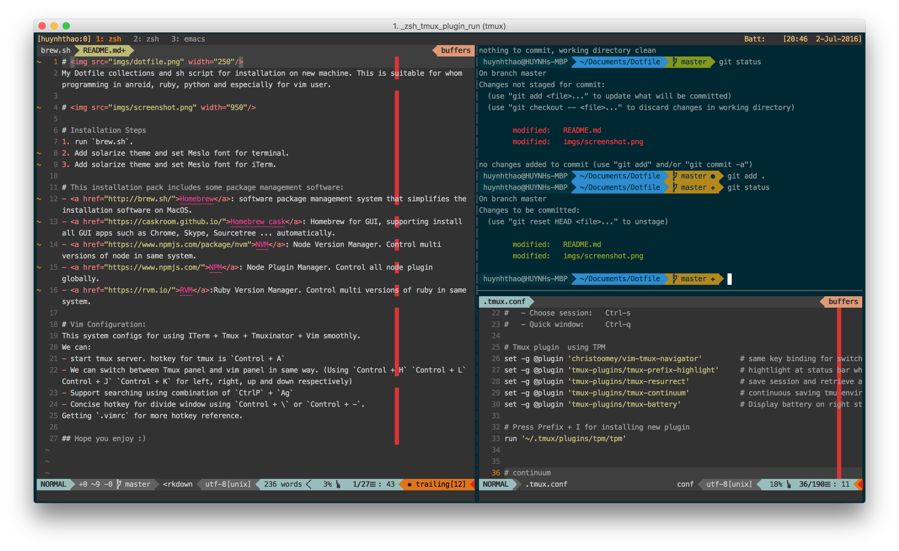

# 
My Dotfile collections and sh script for installation on new machine. This is suitable for whom programming in anroid, ruby, python and especially for vim user.

# 

# Installation Steps
1. run `brew.sh`.
2. Add solarize theme and Meslo font for terminal.
3. Add solarize theme and Meslo font for iterm.

# This installation pack includes some package management software:
- <a href="">Homebrew</a>: software package management system that simplifies the installation software on MacOS. 
- <a href="">Homebrew cask</a>: Homebrew for GUI, supporting install all GUI apps such as Chrome, Skype, Sourcetree ... automatically.
- <a href="">NVM</a>: Node Version Manager. Control multi versions of node in same system. 
- <a href="">NPM</a>: Node Plugin Manager. Control all node plugin globally. 
- <a href="">RVM</a>:Ruby Version Manager. Control multi versions of ruby in same system. 

# Vim Configuration:
This system configs for using ITerm + Tmux + Tmuxinator + Vim smoothly.
We can:
- start tmux server. hotkey for tmux is `Control + A`
- We can switch between Tmux panel and vim panel in same way. (Using `Control + H` `Control + L` Control + J` `Control + K` for left, right, up and down respectively)
- Support searching using combination of `CtrlP` + `Ag`
- Concise hotkey for divide window using `Control + \` or `Control + -`.
Getting `.vimrc` for more hotkey reference.

## Hope you enjoy :)
